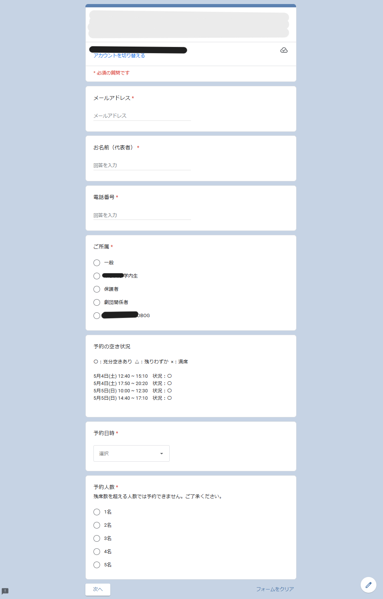
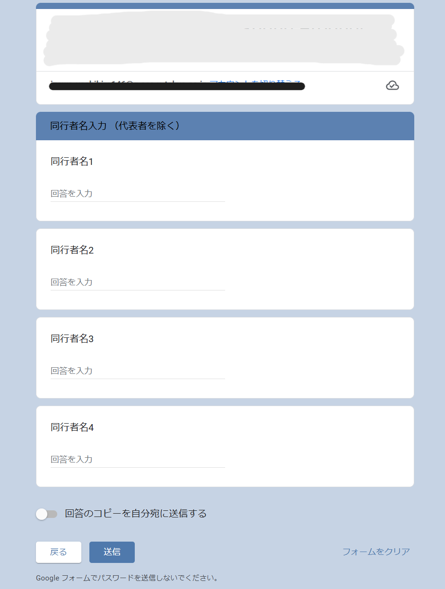
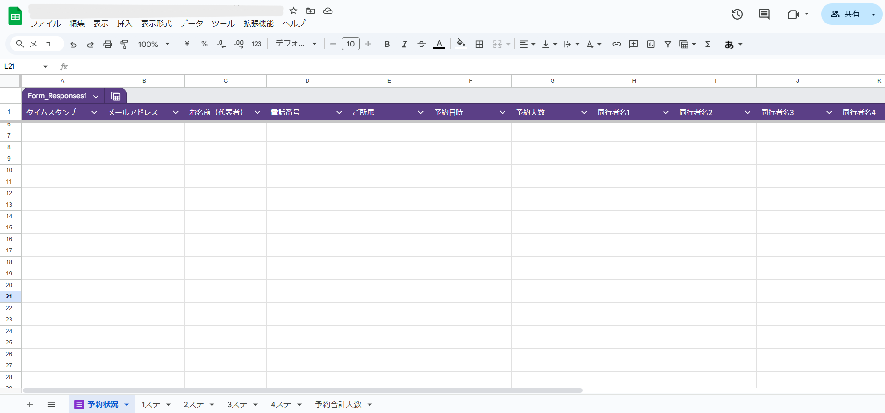
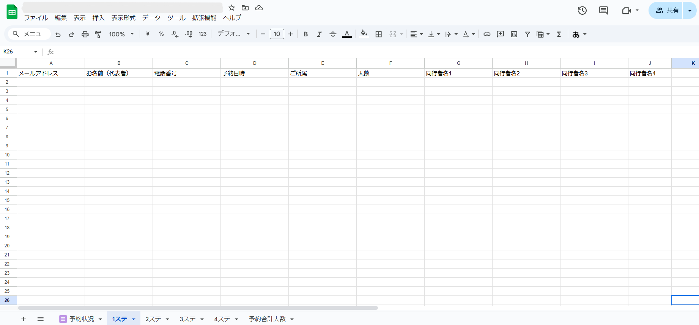
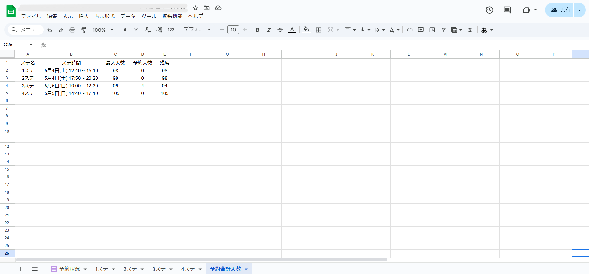
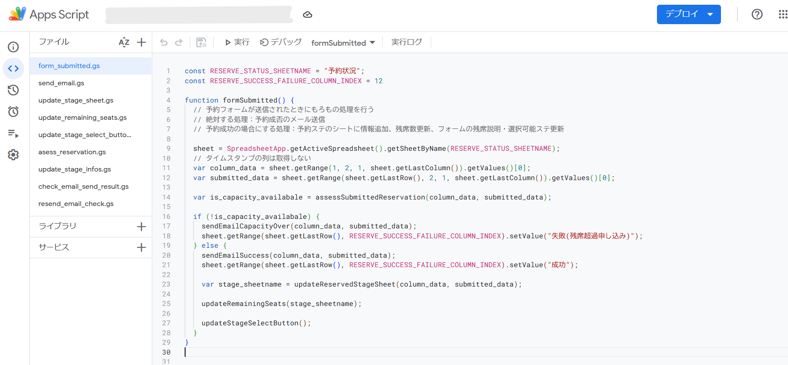
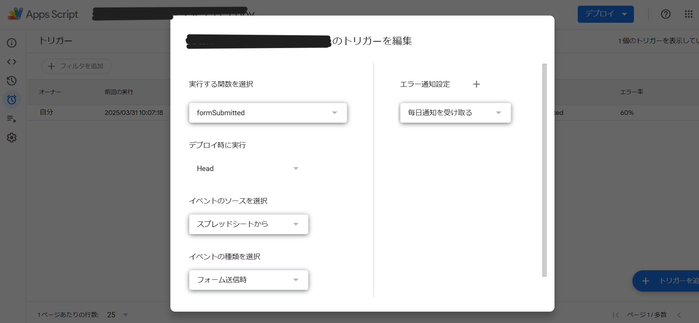

# 観劇予約フォームシステム
（with Google Form, Google Spreadsheet, GAS）

GoogleフォームとGoogleスプレッドシートを使った観劇予約フォームシステムです．

## 作成手順
※プログラムはフォーム項目の順番，スプシのシート名に依存しているため，同一の順番で作成してください．  変更したい場合はプログラムの修正が必要です🙇‍♂️
1. Googleフォームを作成
    - [このフォーム](https://docs.google.com/forms/d/e/1FAIpQLScPAlKBT6gZzwkpSjzE9CfoxorkBzL9Xeh1m7tN74fxBZMZzw/viewform)を参考に，Googleフォームを作成します．
    - フォーム項目のタイトルは↑のフォームと同一にしていただくと，プログラムの修正が不要です．
    - 1セクション
        - メールアドレス
        - お名前（代表者）
        - 電話番号
        - ご所属
        - 予約の空き状況
            - 説明文がフォーム送信ごとに更新される
            - 空き状況：`〇：充分空きあり  △：残りわずか  ×：満席`
            - `▲`：残席数が`15%`未満の場合．残席数も表示される
        - 予約日時
            - フォーム送信ごとに，プルダウン選択肢が更新される
            - ↑のフォームでは4公演なので，4つの項目を作成
        - 予約人数
            - ラジオボタン，この人数-1個の項目を2セクションに配置
    - 2セクション
        - 同行者名入力（代表者を除く）
        - 同行者名1
        - 同行者名2
        - 同行者名3
        - 同行者名4
    <p align="center">
        
        
    </p>

2. Googleスプレッドシートを作成
    - 1で作成したGoogleフォームの回答が記録されるGoogleスプレッドシートを作成します．
    - 作成したスプレッドシートを1で作成したGoogleフォームに紐付けます．
    - 紐づけられたスプレッドシートのシート名は`予約状況`にしてください．
        - このシートにはフォーム送信ごとの回答が記録されます．
    - 公演の数だけ追加でシートを作成します．
        - シート名は`1ステ`，`2ステ`，`3ステ`，`4ステ`にしてください．
        - 各シートについて，フォーム項目のタイトルを記入します．  
            `メールアドレス,	お名前（代表者）,	電話番号,	予約日時,	ご所属,	人数,	同行者名1,	同行者名2,	同行者名3,	同行者名4`
        - 2行目以降に，各公演ごとの回答が記録されます．
    - `予約合計人数`シートを作成します．
        - 以下のようなフォーマットで記入します．
            ```
            ステ名	ステ時間	最大人数	予約人数	残席
            1ステ	5月4日(土) 12:40 ~ 15:10	98	0	98
            2ステ	5月4日(土) 17:50 ~ 20:20	98	0	98
            3ステ	5月5日(日) 10:00 ~ 12:30	98	0	98
            4ステ	5月5日(日) 14:40 ~ 17:10	105	0	105
            ```
        - フォームが送信されるごとに，予約人数に応じて残席数が更新されます．
        - 同時に，この残席数の情報を基に，フォームの予約日時のプルダウンの説明文・選択肢が更新されます．
        - 残席数が`15%`未満の場合，その公演の予約状況が`〇`から`▲(残席わずか)`に変更され，残席数が表示される
        - 残席数が`0`になると，`▲`から`×(満席)`に変更され，その公園の選択肢がフォームから削除される
    <p align="center">
        
        
        
    </p>

3. Google Apps Script（GAS）を作成
    - 2で作成したGoogleスプレッドシートに紐付けるGoogle Apps Scriptを作成します．
    - このリポジトリの`src/`の各ファイルをGASにコピペします．
        - このリポジトリでは`.js`としていますが，GAS上では`.gs`として保存してください．
        - GASでは同一プロジェクト内のすべてのファイルの内容を参照できるので，`fileA`で宣言した関数や変数を，`import`などを使わずに`fileB`で使うことができます．
        - よって，`src/`の全ファイルの内容を`main.gs`にまとめても構いません．
        - `form_submitted.js`がメインの処理を行うファイルです．
    - 各ファイルの内容は以下です．
    <p align="center">
        
        
    </p>